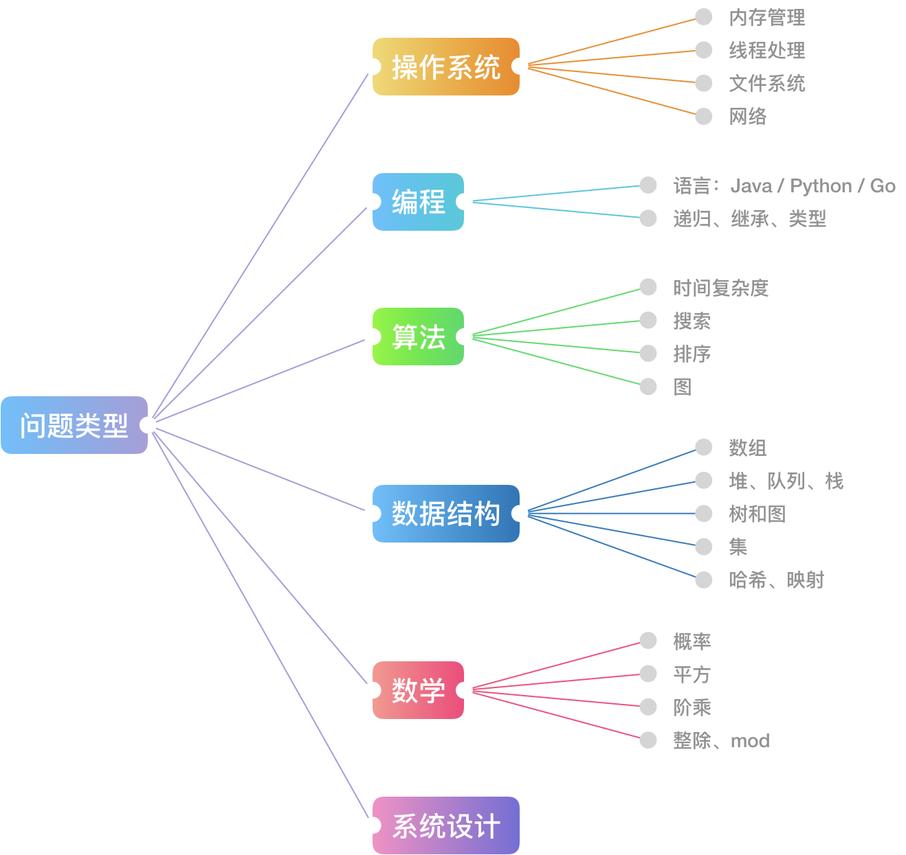

> 转载自https://leetcode-cn.com/explore/interview/card/top-interview-quesitons-in-2018

# 首先，理清这些重要问题类型

面试 和 算法题，作为在电话 / 现场面试中短短一个小时时间内，提供给面试者白板编程解决的算法题目，它与笔试上机、编程竞赛中的题目在难度与形式上还是有一些不同的。

力扣为大家总结了一张互联网公司面试中经常考察的问题类型总结的思维导图，我们可以结合图片中的信息分析一下。

可以明确的一点是，面试算法题目在难度上（尤其是代码难度上）会略低一些，倾向于考察一些基础数据结构与算法，对于高级算法和奇技淫巧一般不作考察。

代码题主要考察编程语言的应用是否熟练，基础是否扎实，一般来会让面试者写出代码完成一些简单的需求或者使用递归实现某些功能，而数学题倾向于考察概率相关的问题。

以上这两类问题，出现的频率不会很高，即使出现了也应该是面试中的简单部分，相信一定难不倒在座的各位。

# 其次，掌握你的学习方向

算法与数据结构是面试考察的重中之重，也是大家日后学习时需要着重训练的部分。简单的总结一下，大约有这些内容：

## 算法 - Algorithms

* 排序算法：快速排序、归并排序、计数排序
* 搜索算法：回溯、递归、剪枝技巧
* 图论：最短路、最小生成树、网络流建模
* 动态规划：背包问题、最长子序列、计数问题
* 基础技巧：分治、倍增、二分、贪心

## 数据结构 - Data Structures

* 数组与链表：单 / 双向链表、跳舞链
* 栈与队列
* 树与图：最近公共祖先、并查集
* 哈希表
* 堆：大 / 小根堆、可并堆
* 字符串：字典树、后缀树
